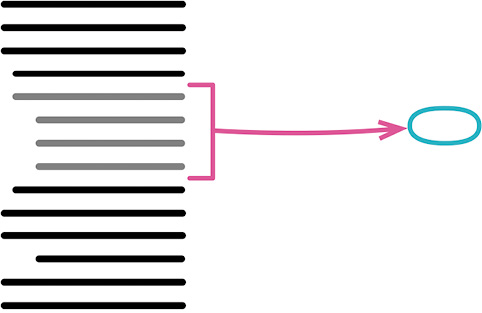

曾用名：提炼函数（Extract Method）

反向重构：[[6.2 Inline Function|内联函数]]（115）



```js
function printOwing(invoice) {
  printBanner();
  let outstanding = calculateOutstanding();

  //print details
  console.log(`name: ${invoice.customer}`);
  console.log(`amount: ${outstanding}`);
}

function printOwing(invoice) {
  printBanner();
  let outstanding = calculateOutstanding();
  printDetails(outstanding);

  function printDetails(outstanding) {
    console.log(`name: ${invoice.customer}`);
    console.log(`amount: ${outstanding}`);
  }
}
```

### 动机

提炼函数是我最常用的重构之一。（在这儿我用了“函数/function”这个词，但换成面向对象语言中的“方法/method”，或者其他任何形式的“过程/procedure”或者“子程序/subroutine”，也同样适用。）我会浏览一段代码，理解其作用，然后将其提炼到一个独立的函数中，并以这段代码的用途为这个函数命名。

对于“何时应该把代码放进独立的函数”这个问题，我曾经听过多种不同的意见。有的观点从代码的长度考虑，认为一个函数应该能在一屏中显示。有的观点从复用的角度考虑，认为只要被用过不止一次的代码，就应该单独放进一个函数；只用过一次的代码则保持内联（inline）的状态。但我认为最合理的观点是“将意图与实现分开”：如果你需要花时间浏览一段代码才能弄清它到底在干什么，那么就应该将其提炼到一个函数中，并根据它所做的事为其命名。以后再读到这段代码时，你一眼就能看到函数的用途，大多数时候根本不需要关心函数如何达成其用途（这是函数体内干的事）。

一旦接受了这个原则，我就逐渐养成一个习惯：写非常小的函数——通常只有几行的长度。在我看来，一个函数一旦超过 6 行，就开始散发臭味。我甚至经常会写一些只有 1 行代码的函数。Kent Beck 曾向我展示最初的 Smalltalk 系统中的一个例子，从那时起我就接受了“函数名的长度不重要”的观念。那时运行 Smalltalk 的计算机只有黑白屏显示器，如果你想高亮突显某些文本或图像，就需要反转视频的显示。为此，Smalltalk 用于控制图像显示的类有一个叫作 highlight 的方法，其中的实现就只是调用 reverse 方法。在这个例子里，highlight 方法的名字比实现还长，但这并不重要，因为在这个方法中，代码的意图与实现之间有着相当大的距离。

有些人担心短函数会造成大量函数调用，因而影响性能。在我尚且年轻时，有时确实会有这个问题；但如今“由于函数调用影响性能”的情况已经非常罕见了。短函数常常能让编译器的优化功能运转更良好，因为短函数可以更容易地被缓存。所以，应该始终遵循性能优化的一般指导方针，不用过早担心性能问题。

小函数得有个好名字才行，所以你必须在命名上花心思。起好名字需要练习，不过一旦你掌握了其中的技巧，就能写出很有自描述性的代码。

我经常会看见这样的情况：在一个大函数中，一段代码的顶上放着一句注释，说明这段代码要做什么。在把这段代码提炼到自己的函数中时，这样的注释往往会提示一个好名字。

### 做法

- 创造一个新函数，根据这个函数的意图来对它命名（以它“做什么”来命名，而不是以它“怎样做”命名）。

::: tip
如果想要提炼的代码非常简单，例如只是一个函数调用，只要新函数的名称能够以更好的方式昭示代码意图，我还是会提炼它；但如果想不出一个更有意义的名称，这就是一个信号，可能我不应该提炼这块代码。不过，我不一定非得马上想出最好的名字，有时在提炼的过程中好的名字才会出现。有时我会提炼一个函数，尝试使用它，然后发现不太合适，再把它内联回去，这完全没问题。只要在这个过程中学到了东西，我的时间就没有白费。

如果编程语言支持嵌套函数，就把新函数嵌套在源函数里，这能减少后面需要处理的超出作用域的变量个数。我可以稍后再使用[[../第 8 章 搬移特性/8.1 Move Function|搬移函数]]（198）把它从源函数中搬移出去。
:::

- 将待提炼的代码从源函数复制到新建的目标函数中。
- 仔细检查提炼出的代码，看看其中是否引用了作用域限于源函数、在提炼出的新函数中访问不到的变量。若是，以参数的形式将它们传递给新函数。

::: tip
如果提炼出的新函数嵌套在源函数内部，就不存在变量作用域的问题了。

这些“作用域限于源函数”的变量通常是局部变量或者源函数的参数。最通用的做法是将它们都作为参数传递给新函数。只要没在提炼部分对这些变量赋值，处理起来就没什么难度。

如果某个变量是在提炼部分之外声明但只在提炼部分被使用，就把变量声明也搬移到提炼部分代码中去。

如果变量按值传递给提炼部分又在提炼部分被赋值，就必须多加小心。如果只有一个这样的变量，我会尝试将提炼出的新函数变成一个查询（query），用其返回值给该变量赋值。

但有时在提炼部分被赋值的局部变量太多，这时最好是先放弃提炼。这种情况下，我会考虑先使用别的重构手法，例如[[../第 9 章 重新组织数据/9.1 Split Variable|拆分变量]]（240）或者[[../第 7 章 封装/7.4 Replace Temp with Query|以查询取代临时变量]]（178），来简化变量的使用情况，然后再考虑提炼函数。
:::

- 所有变量都处理完之后，编译。

::: tip
如果编程语言支持编译期检查的话，在处理完所有变量之后做一次编译是很有用的，编译器经常会帮你找到没有被恰当处理的变量。
:::

- 在源函数中，将被提炼代码段替换为对目标函数的调用。
- 测试。
- 查看其他代码是否有与被提炼的代码段相同或相似之处。如果有，考虑使用[[../第 8 章 搬移特性/8.5 Replace Inline Code with Function Call|以函数调用取代内联代码]]（222）令其调用提炼出的新函数。

::: tip
有些重构工具直接支持这一步。如果工具不支持，可以快速搜索一下，看看别处是否还有重复代码。
:::

### 范例：无局部变量

在最简单的情况下，提炼函数易如反掌。请看下列函数：

```js
function printOwing(invoice) {
  let outstanding = 0;

  console.log("***********************");
  console.log("**** Customer Owes ****");
  console.log("***********************");

  // calculate outstanding
  for (const o of invoice.orders) {
    outstanding += o.amount;
  }

  // record due date
  const today = Clock.today;
  invoice.dueDate = new Date(
    today.getFullYear(),
    today.getMonth(),
    today.getDate() + 30
  );

  //print details
  console.log(`name: ${invoice.customer}`);
  console.log(`amount: ${outstanding}`);
  console.log(`due: ${invoice.dueDate.toLocaleDateString()}`);
}
```

你可能会好奇 Clock. today 是干什么的。这是一个 Clock Wrapper[mf-cw]，也就是封装系统时钟调用的对象。我尽量避免在代码中直接调用 Date.now () 这样的函数，因为这会导致测试行为不可预测，以及在诊断故障时难以复制出错时的情况。

我们可以轻松提炼出“打印横幅”的代码。我只需要剪切、粘贴再插入一个函数调用动作就行了：

```js
function printOwing(invoice) {
  let outstanding = 0;

  printBanner();

  // calculate outstanding
  for (const o of invoice.orders) {
    outstanding += o.amount;
  }

  // record due date
  const today = Clock.today;
  invoice.dueDate = new Date(
    today.getFullYear(),
    today.getMonth(),
    today.getDate() + 30
  );

  //print details
  console.log(`name: ${invoice.customer}`);
  console.log(`amount: ${outstanding}`);
  console.log(`due: ${invoice.dueDate.toLocaleDateString()}`);
}
function printBanner() {
  console.log("***********************");
  console.log("**** Customer Owes ****");
  console.log("***********************");
}
```

同样，我还可以把“打印详细信息”部分也提炼出来：

```js
function printOwing(invoice) {
 let outstanding = 0;

 printBanner();

 // calculate outstanding
 for (const o of invoice.orders) {
  outstanding += o.amount;
 }

 // record due date
 const today = Clock.today;
 invoice.dueDate = new Date(today.getFullYear(), today.getMonth(), today.getDate() + 30);

 printDetails();

 function printDetails() {
  console.log(`name: ${invoice.customer}`);
  console.log(`amount: ${outstanding}`);
  console.log(`due: ${invoice.dueDate.toLocaleDateString()}`);
}
```

看起来提炼函数是一个极其简单的重构。但很多时候，情况会变得比较复杂。

在上面的例子中，我把 printDetails 函数嵌套在 printOwing 函数内部，这样前者就能访问到 printOwing 内部定义的所有变量。如果我使用的编程语言不支持嵌套函数，就没法这样操作了，那么我就要面对“提炼出一个顶层函数”的问题。此时我必须细心处理“只存在于源函数作用域”的变量，包括源函数的参数以及源函数内部定义的临时变量。

### 范例：有局部变量

局部变量最简单的情况是：被提炼代码段只是读取这些变量的值，并不修改它们。这种情况下我可以简单地将它们当作参数传给目标函数。所以，如果我面对下列函数：

```js
function printOwing(invoice) {
 let outstanding = 0;

 printBanner();

 // calculate outstanding
 for (const o of invoice.orders) {
  outstanding += o.amount;
 }

 // record due date
 const today = Clock.today;
 invoice.dueDate = new Date(today.getFullYear(), today.getMonth(), today.getDate() + 30);

 //print details
 console.log(`name: ${invoice.customer}`);
 console.log(`amount: ${outstanding}`);
 console.log(`due: ${invoice.dueDate.toLocaleDateString()}`);
```

就可以将“打印详细信息”这一部分提炼为带两个参数的函数：

```js
function printOwing(invoice) {
  let outstanding = 0;

  printBanner();

  // calculate outstanding
  for (const o of invoice.orders) {
    outstanding += o.amount;
  }

  // record due date
  const today = Clock.today;
  invoice.dueDate = new Date(
    today.getFullYear(),
    today.getMonth(),
    today.getDate() + 30
  );

  printDetails(invoice, outstanding);
}
function printDetails(invoice, outstanding) {
  console.log(`name: ${invoice.customer}`);
  console.log(`amount: ${outstanding}`);
  console.log(`due: ${invoice.dueDate.toLocaleDateString()}`);
}
```

如果局部变量是一个数据结构（例如数组、记录或者对象），而被提炼代码段又修改了这个结构中的数据，也可以如法炮制。所以，“设置到期日”的逻辑也可以用同样的方式提炼出来：

```js
function printOwing(invoice) {
  let outstanding = 0;

  printBanner();

  // calculate outstanding
  for (const o of invoice.orders) {
    outstanding += o.amount;
  }

  recordDueDate(invoice);
  printDetails(invoice, outstanding);
}
function recordDueDate(invoice) {
  const today = Clock.today;
  invoice.dueDate = new Date(
    today.getFullYear(),
    today.getMonth(),
    today.getDate() + 30
  );
}
```

### 范例：对局部变量再赋值

如果被提炼代码段对局部变量赋值，问题就变得复杂了。这里我们只讨论临时变量的问题。如果你发现源函数的参数被赋值，应该马上使用[[../第 9 章 重新组织数据/9.1 Split Variable|拆分变量]]（240）将其变成临时变量。

被赋值的临时变量也分两种情况。较简单的情况是：这个变量只在被提炼代码段中使用。若果真如此，你可以将这个临时变量的声明移到被提炼代码段中，然后一起提炼出去。如果变量的初始化和使用离得有点儿远，可以用[[../第 8 章 搬移特性/8.6 Slide Statements|移动语句]]（223）把针对这个变量的操作放到一起。

比较糟糕的情况是：被提炼代码段之外的代码也使用了这个变量。此时我需要返回修改后的值。我会用下面这个已经很眼熟的函数来展示该怎么做：

```js
function printOwing(invoice) {
  let outstanding = 0;

  printBanner();

  // calculate outstanding
  for (const o of invoice.orders) {
    outstanding += o.amount;
  }

  recordDueDate(invoice);
  printDetails(invoice, outstanding);
}
```

前面的重构我都一步到位地展示了结果，因为它们都很简单。但这次我会一步一步展示“做法”里的每个步骤。

首先，把变量声明移动到使用处之前。

```js
function printOwing(invoice) {
  printBanner();

  // calculate outstanding
  let outstanding = 0;
  for (const o of invoice.orders) {
    outstanding += o.amount;
  }

  recordDueDate(invoice);
  printDetails(invoice, outstanding);
}
```

然后把想要提炼的代码复制到目标函数中。

```js
function printOwing(invoice) {
  printBanner();

  // calculate outstanding
  let outstanding = 0;
  for (const o of invoice.orders) {
    outstanding += o.amount;
  }

  recordDueDate(invoice);
  printDetails(invoice, outstanding);
}
function calculateOutstanding(invoice) {
  let outstanding = 0;
  for (const o of invoice.orders) {
    outstanding += o.amount;
  }
  return outstanding;
}
```

由于 outstanding 变量的声明已经被搬移到提炼出的新函数中，就不需要再将其作为参数传入了。outstanding 是提炼代码段中唯一被重新赋值的变量，所以我可以直接返回它。

我的 JavaScript 环境在编译期提供不了任何价值——简直还不如文本编辑器的语法分析有用，所以“做法”里的“编译”一步可以跳过了。下一件事是修改原来的代码，令其调用新函数。新函数返回了修改后的 outstanding 变量值，我需要将其存入原来的变量中。

```js
function printOwing(invoice) {
  printBanner();
  let outstanding = calculateOutstanding(invoice);
  recordDueDate(invoice);
  printDetails(invoice, outstanding);
}
function calculateOutstanding(invoice) {
  let outstanding = 0;
  for (const o of invoice.orders) {
    outstanding += o.amount;
  }
  return outstanding;
}
```

在收工之前，我还要修改返回值的名字，使其符合我一贯的编码风格。

```js
function printOwing(invoice) {
  printBanner();
  const outstanding = calculateOutstanding(invoice);
  recordDueDate(invoice);
  printDetails(invoice, outstanding);
}
function calculateOutstanding(invoice) {
  let result = 0;
  for (const o of invoice.orders) {
    result += o.amount;
  }
  return result;
}
```

我还顺手把原来的 outstanding 变量声明成 const 的，令其在初始化之后不能再次被赋值。

这时候，你可能会问：“如果需要返回的变量不止一个，又该怎么办呢？”

有几种选择。最好的选择通常是：挑选另一块代码来提炼。我比较喜欢让每个函数都只返回一个值，所以我会安排多个函数，用以返回多个值。如果真的有必要提炼一个函数并返回多个值，可以构造并返回一个记录对象—不过通常更好的办法还是回过头来重新处理局部变量，我常用的重构手法有[[../第 7 章 封装/7.4 Replace Temp with Query|以查询取代临时变量]]（178）和[[../第 9 章 重新组织数据/9.1 Split Variable|拆分变量]]（240）。

如果我想把提炼出的函数搬移到别的上下文（例如变成顶层函数），会引发一些有趣的问题。我偏好小步前进，所以我本能的做法是先提炼成嵌套函数，然后再将其移入新的上下文。但这种做法的麻烦在于处理局部变量，而这个困难无法提前发现，直到我开始最后的搬移时才突然暴露。从这个角度考虑，即便可以先提炼成嵌套函数，或许也应该至少将目标函数放在源函数的同级，这样我就能立即看出提炼的范围是否合理。