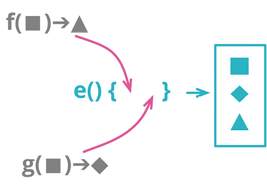

```js
function base(aReading) {...}
function taxableCharge(aReading) {...}
```

```js
function enrichReading(argReading) {
  const aReading = _.cloneDeep(argReading);
  aReading.baseCharge = base(aReading);
  aReading.taxableCharge = taxableCharge(aReading);
  return aReading;
}
```

### 动机

在软件中，经常需要把数据“喂”给一个程序，让它再计算出各种派生信息。这些派生数值可能会在几个不同地方用到，因此这些计算逻辑也常会在用到派生数据的地方重复。我更愿意把所有计算派生数据的逻辑收拢到一处，这样始终可以在固定的地方找到和更新这些逻辑，避免到处重复。

一个方式是采用数据变换（transform）函数：这种函数接受源数据作为输入，计算出所有的派生数据，将派生数据以字段形式填入输出数据。有了变换函数，我就始终只需要到变换函数中去检查计算派生数据的逻辑。

函数组合成变换的替代方案是[[../第 6 章 第一组重构/6.9 Combine Functions into Class|函数组合成类]]（144），后者的做法是先用源数据创建一个类，再把相关的计算逻辑搬移到类中。这两个重构手法都很有用，我常会根据代码库中已有的编程风格来选择使用其中哪一个。不过，两者有一个重要的区别：如果代码中会对源数据做更新，那么使用类要好得多；如果使用变换，派生数据会被存储在新生成的记录中，一旦源数据被修改，我就会遭遇数据不一致。

我喜欢把函数组合起来的原因之一，是为了避免计算派生数据的逻辑到处重复。从道理上来说，只用[[6.1 Extract Function|提炼函数]]（106）也能避免重复，但孤立存在的函数常常很难找到，只有把函数和它们操作的数据放在一起，用起来才方便。引入变换（或者类）都是为了让相关的逻辑找起来方便。

### 做法

- 创建一个变换函数，输入参数是需要变换的记录，并直接返回该记录的值。

::: tip
这一步通常需要对输入的记录做深复制（deep copy）。此时应该写个测试，确保变换不会修改原来的记录。
:::

- 挑选一块逻辑，将其主体移入变换函数中，把结果作为字段添加到输出记录中。修改客户端代码，令其使用这个新字段。

::: tip
如果计算逻辑比较复杂，先用[[6.1 Extract Function|提炼函数]]（106）提炼之。
:::

- 测试。
- 针对其他相关的计算逻辑，重复上述步骤。

### 范例

在我长大的国度，茶是生活中的重要部分，以至于我想象了这样一种特别的公共设施，专门给老百姓供应茶水。每个月，从这个设备上可以得到读数（reading），从而知道每位顾客取用了多少茶。

```js
reading = { customer: "ivan", quantity: 10, month: 5, year: 2017 };
```

几个不同地方的代码分别根据茶的用量进行计算。一处是计算应该向顾客收取的基本费用。

#### 客户端 1...

```js
const aReading = acquireReading();
const baseCharge = baseRate(aReading.month, aReading.year) * aReading.quantity;
```

另一处是计算应该交税的费用—比基本费用要少，因为政府明智地认为，每个市民都有权免税享受一定量的茶水。

#### 客户端 2...

```js
const aReading = acquireReading();
const base = baseRate(aReading.month, aReading.year) * aReading.quantity;
const taxableCharge = Math.max(0, base - taxThreshold(aReading.year));
```

浏览处理这些数据记录的代码，我发现有很多地方在做着相似的计算。这样的重复代码，一旦需要修改（我打赌这只是早晚的问题），就会造成麻烦。我可以用[[6.1 Extract Function|提炼函数]]（106）来处理这些重复的计算逻辑，但这样提炼出来的函数会散落在程序中，以后的程序员还是很难找到。说真的，我还真在另一块代码中找到了一个这样的函数。

#### 客户端 3...

```js
const aReading = acquireReading();
const basicChargeAmount = calculateBaseCharge(aReading);

function calculateBaseCharge(aReading) {
  return baseRate(aReading.month, aReading.year) * aReading.quantity;
}
```

处理这种情况的一个办法是，把所有这些计算派生数据的逻辑搬移到一个变换函数中，该函数接受原始的“读数”作为输入，输出则是增强的“读数”记录，其中包含所有共用的派生数据。

我先要创建一个变换函数，它要做的事很简单，就是复制输入的对象：

```js
function enrichReading(original) {
  const result = _.cloneDeep(original);
  return result;
}
```

我用了 Lodash 库的 cloneDeep 函数来进行深复制。

这个变换函数返回的本质上仍是原来的对象，只是添加了更多的信息在上面。对于这种函数，我喜欢用“enrich”（增强）这个词来给它命名。如果它生成的是跟原来完全不同的对象，我就会用“transform”（变换）来命名它。

然后我挑选一处想要搬移的计算逻辑。首先，我用现在的 enrichReading 函数来增强“读数”记录，尽管该函数暂时还什么都没做。

#### 客户端 3...

```js
const rawReading = acquireReading();
const aReading = enrichReading(rawReading);
const basicChargeAmount = calculateBaseCharge(aReading);
```

然后我运用[[../第 8 章 搬移特性/8.1 Move Function|搬移函数]]（198）把 calculateBaseCharge 函数搬移到增强过程中：

```js
function enrichReading(original) {
  const result = _.cloneDeep(original);
  result.baseCharge = calculateBaseCharge(result);
  return result;
}
```

在变换函数内部，我乐得直接修改结果对象，而不是每次都复制一个新对象。我喜欢不可变的数据，但在大部分编程语言中，保持数据完全不可变很困难。在程序模块的边界处，我做好了心理准备，多花些精力来支持不可变性。但在较小的范围内，我可以接受可变的数据。另外，我把这里用到的变量命名为 aReading，表示它是一个累积变量（accumulating variable）。这样当我把更多的逻辑搬移到变换函数 enrichReading 中时，这个变量名也仍然适用。

修改客户端代码，令其改用增强后的字段：

#### 客户端 3...

```js
const rawReading = acquireReading();
const aReading = enrichReading(rawReading);
const basicChargeAmount = aReading.baseCharge;
```

当所有调用 calculateBaseCharge 的地方都修改完成后，就可以把这个函数内嵌到 enrichReading 函数中，从而更清楚地表明态度：如果需要“计算基本费用”的逻辑，请使用增强后的记录。

在这里要当心一个陷阱：在编写 enrichReading 函数时，我让它返回了增强后的读数记录，这背后隐含的意思是原始的读数记录不会被修改。所以我最好为此加个测试。

```js
it("check reading unchanged", function () {
  const baseReading = { customer: "ivan", quantity: 15, month: 5, year: 2017 };
  const oracle = _.cloneDeep(baseReading);
  enrichReading(baseReading);
  assert.deepEqual(baseReading, oracle);
});
```

现在我可以修改客户端 1 的代码，让它也使用这个新添的字段。

#### 客户端 1...

```js
const rawReading = acquireReading();
const aReading = enrichReading(rawReading);
const baseCharge = aReading.baseCharge;
```

此时可以考虑用[[6.4 Inline Variable|内联变量]]（123）去掉 baseCharge 变量。

现在我转头去看“计算应税费用”的逻辑。第一步是把变换函数用起来：

```js
const rawReading = acquireReading();
const aReading = enrichReading(rawReading);
const base = baseRate(aReading.month, aReading.year) * aReading.quantity;
const taxableCharge = Math.max(0, base - taxThreshold(aReading.year));
```

基本费用的计算逻辑马上就可以改用变换得到的新字段代替。如果计算逻辑比较复杂，我可以先运用[[6.1 Extract Function|提炼函数]]（106）。不过这里的情况足够简单，一步到位修改过来就行。

```js
const rawReading = acquireReading();
const aReading = enrichReading(rawReading);
const base = aReading.baseCharge;
const taxableCharge = Math.max(0, base - taxThreshold(aReading.year));
```

执行测试之后，我就用[[6.4 Inline Variable|内联变量]]（123）去掉 base 变量：

```js
const rawReading = acquireReading();
const aReading = enrichReading(rawReading);
const taxableCharge = Math.max(
  0,
  aReading.baseCharge - taxThreshold(aReading.year)
);
```

然后把计算逻辑搬移到变换函数中：

```js
function enrichReading(original) {
  const result = _.cloneDeep(original);
  result.baseCharge = calculateBaseCharge(result);
  result.taxableCharge = Math.max(
    0,
    result.baseCharge - taxThreshold(result.year)
  );
  return result;
}
```

修改使用方代码，让它使用新添的字段。

```js
const rawReading = acquireReading();
const aReading = enrichReading(rawReading);
const taxableCharge = aReading.taxableCharge;
```

测试。现在我可以再次用[[6.4 Inline Variable|内联变量]]（123）把 taxableCharge 变量也去掉。

增强后的读数记录有一个大问题：如果某个客户端修改了一项数据的值，会发生什么？比如说，如果某处代码修改了 quantity 字段的值，就会导致数据不一致。在 JavaScript 中，避免这种情况最好的办法是不要使用本重构手法，改用[[../第 6 章 第一组重构/6.9 Combine Functions into Class|函数组合成类]]（144）。如果编程语言支持不可变的数据结构，那么就没有这个问题了，那样的语言中会更常用到变换。但即便编程语言不支持数据结构不可变，如果数据是在只读的上下文中被使用（例如在网页上显示派生数据），还是可以使用变换。