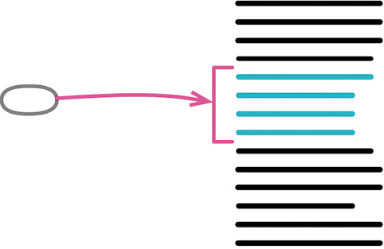

曾用名：内联函数（Inline Method）

反向重构：[[6.1 Extract Function|提炼函数]]（106）



```js
function getRating(driver) {
 return moreThanFiveLateDeliveries(driver) ? 2 : 1;
}

function moreThanFiveLateDeliveries(driver) {
 return driver.numberOfLateDeliveries &gt; 5;
}


function getRating(driver) {
 return (driver.numberOfLateDeliveries &gt; 5) ? 2 : 1;
}
```

### 动机

本书经常以简短的函数表现动作意图，这样会使代码更清晰易读。但有时候你会遇到某些函数，其内部代码和函数名称同样清晰易读。也可能你重构了该函数的内部实现，使其内容和其名称变得同样清晰。若果真如此，你就应该去掉这个函数，直接使用其中的代码。间接性可能带来帮助，但非必要的间接性总是让人不舒服。

另一种需要使用内联函数的情况是：我手上有一群组织不甚合理的函数。可以将它们都内联到一个大型函数中，再以我喜欢的方式重新提炼出小函数。

如果代码中有太多间接层，使得系统中的所有函数都似乎只是对另一个函数的简单委托，造成我在这些委托动作之间晕头转向，那么我通常都会使用内联函数。当然，间接层有其价值，但不是所有间接层都有价值。通过内联手法，我可以找出那些有用的间接层，同时将无用的间接层去除。

### 做法

- 检查函数，确定它不具多态性。

::: tip
如果该函数属于一个类，并且有子类继承了这个函数，那么就无法内联。
:::

- 找出这个函数的所有调用点。
- 将这个函数的所有调用点都替换为函数本体。
- 每次替换之后，执行测试。

::: tip
不必一次完成整个内联操作。如果某些调用点比较难以内联，可以等到时机成熟后再来处理。
:::

- 删除该函数的定义。

被我这样一写，内联函数似乎很简单。但情况往往并非如此。对于递归调用、多返回点、内联至另一个对象中而该对象并无访问函数等复杂情况，我可以写上好几页。我之所以不写这些特殊情况，原因很简单：如果你遇到了这样的复杂情况，就不应该使用这个重构手法。

### 范例

在最简单的情况下，这个重构简单得不值一提。一开始的代码是这样：

```js
function rating(aDriver) {
  return moreThanFiveLateDeliveries(aDriver) ? 2 : 1;
}
function moreThanFiveLateDeliveries(aDriver) {
  return aDriver.numberOfLateDeliveries & gt;
  5;
}
```

我只要把被调用的函数的 return 语句复制出来，粘贴到调用处，取代原本的函数调用，就行了。

```js
function rating(aDriver) {
  return aDriver.numberOfLateDeliveries & amp;
  gt;
  5 ? 2 : 1;
}
```

不过实际情况可能不会这么简单，需要我多做一点儿工作，帮助代码融入它的新家。例如，开始时的代码与前面稍有不同：

```js
function rating(aDriver) {
  return moreThanFiveLateDeliveries(aDriver) ? 2 : 1;
}

function moreThanFiveLateDeliveries(dvr) {
  return dvr.numberOfLateDeliveries & gt;
  5;
}
```

几乎是一样的代码，但 moreThanFiveLateDeliveries 函数声明的形式参数名与调用处使用的变量名不同，所以我在内联时需要对代码做些微调。

```js
function rating(aDriver) {
  return aDriver.numberOfLateDeliveries & gt;
  5 ? 2 : 1;
}
```

情况还可能更复杂。例如，请看下列代码：

```js
function reportLines(aCustomer) {
  const lines = [];
  gatherCustomerData(lines, aCustomer);
  return lines;
}
function gatherCustomerData(out, aCustomer) {
  out.push(["name", aCustomer.name]);
  out.push(["location", aCustomer.location]);
}
```

我要把 gatherCustomerData 内联到 reportLines 中，这时简单的剪切和粘贴就不够了。这段代码还不算很麻烦，大多数时候我还是一步到位地完成了重构，只是需要做些调整。如果想更谨慎些，也可以每次搬移一行代码：可以首先对第一行代码使用[[../第 8 章 搬移特性/8.4 Move Statements to Callers|搬移语句到调用者]]（217）——我还是用简单的“剪切-粘贴-调整”方式进行。

```js
function reportLines(aCustomer) {
  const lines = [];
  lines.push(["name", aCustomer.name]);
  gatherCustomerData(lines, aCustomer);
  return lines;
}
function gatherCustomerData(out, aCustomer) {
  out.push(["name", aCustomer.name]);
  out.push(["location", aCustomer.location]);
}
```

然后继续处理后面的代码行，直到完成整个重构。

```js
function reportLines(aCustomer) {
  const lines = [];
  lines.push(["name", aCustomer.name]);
  lines.push(["location", aCustomer.location]);
  return lines;
}
```

重点在于始终小步前进。大多数时候，由于我平时写的函数都很小，内联函数可以一步完成，顶多需要一点代码调整。但如果遇到了复杂的情况，我会每次内联一行代码。哪怕只是处理一行代码，也可能遇到麻烦，那么我就会使用更精细的重构手法[[../第 8 章 搬移特性/8.4 Move Statements to Callers|搬移语句到调用者]]（217），将步子再拆细一点。有时我会自信满满地快速完成重构，然后测试却失败了，这时我会回退到上一个能通过测试的版本，带着一点儿懊恼，以更小的步伐再次重构。