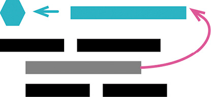

曾用名：引入解释性变量（Introduce Explaining Variable）

反向重构：[[6.4 Inline Variable|内联变量]]（123）



```js
return (
  order.quantity * order.itemPrice -
  Math.max(0, order.quantity - 500) * order.itemPrice * 0.05 +
  Math.min(order.quantity * order.itemPrice * 0.1, 100)
);

const basePrice = order.quantity * order.itemPrice;
const quantityDiscount =
  Math.max(0, order.quantity - 500) * order.itemPrice * 0.05;
const shipping = Math.min(basePrice * 0.1, 100);
return basePrice - quantityDiscount + shipping;
```

### 动机

表达式有可能非常复杂而难以阅读。这种情况下，局部变量可以帮助我们将表达式分解为比较容易管理的形式。在面对一块复杂逻辑时，局部变量使我能给其中的一部分命名，这样我就能更好地理解这部分逻辑是要干什么。

这样的变量在调试时也很方便，它们给调试器和打印语句提供了便利的抓手。

如果我考虑使用提炼变量，就意味着我要给代码中的一个表达式命名。一旦决定要这样做，我就得考虑这个名字所处的上下文。如果这个名字只在当前的函数中有意义，那么提炼变量是个不错的选择；但如果这个变量名在更宽的上下文中也有意义，我就会考虑将其暴露出来，通常以函数的形式。如果在更宽的范围可以访问到这个名字，就意味着其他代码也可以用到这个表达式，而不用把它重写一遍，这样能减少重复，并且能更好地表达我的意图。

“将新的名字暴露得更宽”的坏处则是需要额外的工作量。如果工作量很大，我会暂时搁下这个想法，稍后再用[[../第 7 章 封装/7.4 Replace Temp with Query|以查询取代临时变量]]（178）来处理它。但如果处理其他很简单，我就会立即动手，这样马上就可以使用这个新名字。有一个好的例子：如果我处理的这段代码属于一个类，对这个新的变量使用[[6.1 Extract Function|提炼函数]]（106）会很容易。

### 做法

- 确认要提炼的表达式没有副作用。
- 声明一个不可修改的变量，把你想要提炼的表达式复制一份，以该表达式的结果值给这个变量赋值。
- 用这个新变量取代原来的表达式。
- 测试。

如果该表达式出现了多次，请用这个新变量逐一替换，每次替换之后都要执行测试。

### 范例

我们从一个简单计算开始：

```js
function price(order) {
  //price is base price - quantity discount + shipping
  return (
    order.quantity * order.itemPrice -
    Math.max(0, order.quantity - 500) * order.itemPrice * 0.05 +
    Math.min(order.quantity * order.itemPrice * 0.1, 100)
  );
}
```

这段代码还算简单，不过我可以让它变得更容易理解。首先，我发现，底价（base price）等于数量（quantity）乘以单价（item price）。

```js
function price(order) {
  //price is base price - quantity discount + shipping
  return (
    order.quantity * order.itemPrice -
    Math.max(0, order.quantity - 500) * order.itemPrice * 0.05 +
    Math.min(order.quantity * order.itemPrice * 0.1, 100)
  );
}
```

我把这一新学到的知识放进代码里，创建一个变量，并给它起个合适的名字：

```js
function price(order) {
  //price is base price - quantity discount + shipping
  const basePrice = order.quantity * order.itemPrice;
  return (
    order.quantity * order.itemPrice -
    Math.max(0, order.quantity - 500) * order.itemPrice * 0.05 +
    Math.min(order.quantity * order.itemPrice * 0.1, 100)
  );
}
```

当然，仅仅声明并初始化一个变量没有任何作用，我还得使用它才行。所以，我用这个变量取代了原来的表达式：

```js
function price(order) {
  //price is base price - quantity discount + shipping
  const basePrice = order.quantity * order.itemPrice;
  return (
    basePrice -
    Math.max(0, order.quantity - 500) * order.itemPrice * 0.05 +
    Math.min(order.quantity * order.itemPrice * 0.1, 100)
  );
}
```

稍后的代码还用到了同样的表达式，也可以用新建的变量取代之。

```js
function price(order) {
  //price is base price - quantity discount + shipping
  const basePrice = order.quantity * order.itemPrice;
  return (
    basePrice -
    Math.max(0, order.quantity - 500) * order.itemPrice * 0.05 +
    Math.min(basePrice * 0.1, 100)
  );
}
```

下一行是计算批发折扣（quantity discount）的逻辑，我也将它提炼出来：

```js
function price(order) {
  //price is base price - quantity discount + shipping
  const basePrice = order.quantity * order.itemPrice;
  const quantityDiscount =
    Math.max(0, order.quantity - 500) * order.itemPrice * 0.05;
  return basePrice - quantityDiscount + Math.min(basePrice * 0.1, 100);
}
```

最后，我再把运费（shipping）计算提炼出来。同时我还可以删掉代码中的注释，因为现在代码已经可以完美表达自己的意义了：

```js
function price(order) {
  const basePrice = order.quantity * order.itemPrice;
  const quantityDiscount =
    Math.max(0, order.quantity - 500) * order.itemPrice * 0.05;
  const shipping = Math.min(basePrice * 0.1, 100);
  return basePrice - quantityDiscount + shipping;
}
```

### 范例：在一个类中

下面是同样的代码，但这次它位于一个类中：

```js
class Order {
  constructor(aRecord) {
    this._data = aRecord;
  }

  get quantity() {
    return this._data.quantity;
  }
  get itemPrice() {
    return this._data.itemPrice;
  }

  get price() {
    return (
      this.quantity * this.itemPrice -
      Math.max(0, this.quantity - 500) * this.itemPrice * 0.05 +
      Math.min(this.quantity * this.itemPrice * 0.1, 100)
    );
  }
}
```

我要提炼的还是同样的变量，但我意识到：这些变量名所代表的概念，适用于整个 Order 类，而不仅仅是“计算价格”的上下文。既然如此，我更愿意将它们提炼成方法，而不是变量。

```js
class Order {
  constructor(aRecord) {
    this._data = aRecord;
  }
  get quantity() {
    return this._data.quantity;
  }
  get itemPrice() {
    return this._data.itemPrice;
  }

  get price() {
    return this.basePrice - this.quantityDiscount + this.shipping;
  }
  get basePrice() {
    return this.quantity * this.itemPrice;
  }
  get quantityDiscount() {
    return Math.max(0, this.quantity - 500) * this.itemPrice * 0.05;
  }
  get shipping() {
    return Math.min(this.basePrice * 0.1, 100);
  }
}
```

这是对象带来的一大好处：它们提供了合适的上下文，方便分享相关的逻辑和数据。在如此简单的情况下，这方面的好处还不太明显；但在一个更大的类当中，如果能找出可以共用的行为，赋予它独立的概念抽象，给它起一个好名字，对于使用对象的人会很有帮助。