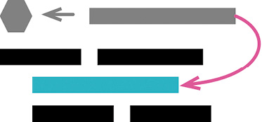

曾用名：内联临时变量（Inline Temp）

反向重构：[[6.3 Extract Variable|提炼变量]]（119）



```js
let basePrice = anOrder.basePrice;
return (basePrice &gt; 1000);
```

```js
return anOrder.basePrice & gt;
1000;
```

### 动机

在一个函数内部，变量能给表达式提供有意义的名字，因此通常变量是好东西。但有时候，这个名字并不比表达式本身更具表现力。还有些时候，变量可能会妨碍重构附近的代码。若果真如此，就应该通过内联的手法消除变量。

### 做法

- 检查确认变量赋值语句的右侧表达式没有副作用。
- 如果变量没有被声明为不可修改，先将其变为不可修改，并执行测试。

::: tip
这是为了确保该变量只被赋值一次。
:::

- 找到第一处使用该变量的地方，将其替换为直接使用赋值语句的右侧表达式。
- 测试。
- 重复前面两步，逐一替换其他所有使用该变量的地方。
- 删除该变量的声明点和赋值语句。
- 测试。