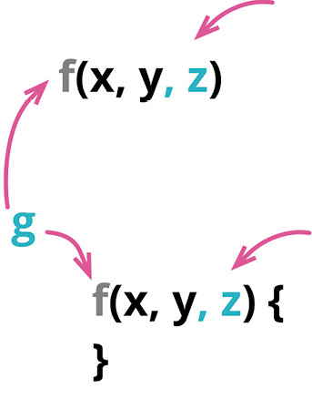

别名：函数改名（Rename Function）

曾用名：函数改名（Rename Method）

曾用名：添加参数（Add Parameter）

曾用名：移除参数（Remove Parameter）

别名：修改签名（Change Signature）



```js
function circum(radius) {...}
```

```js
function circumference(radius) {...}
```

### 动机

函数是我们将程序拆分成小块的主要方式。函数声明则展现了如何将这些小块组合在一起工作——可以说，它们就是软件系统的关节。和任何构造体一样，系统的好坏很大程度上取决于关节。好的关节使得给系统添加新部件很容易；而糟糕的关节则不断招致麻烦，让我们难以看清软件的行为，当需求变化时难以找到合适的地方进行修改。还好，软件是软的，我可以改变这些关节，只是要小心修改。

对于这些关节而言，最重要的元素当属函数的名字。一个好名字能让我一眼看出函数的用途，而不必查看其实现代码。但起一个好名字并不容易，我很少能第一次就把名字起对。“就算这个名字有点迷惑人，还是放着别管吧——说到底，不过就是一个名字而已。”邪恶的混乱魔王就是这样引诱我的。为了拯救程序的灵魂，绝不能上了他的当。如果我看到一个函数的名字不对，一旦发现了更好的名字，就得尽快给函数改名。这样，下一次再看到这段代码时，我就不用再费力搞懂其中到底在干什么。（有一个改进函数名字的好办法：先写一句注释描述这个函数的用途，再把这句注释变成函数的名字。）

对于函数的参数，道理也是一样。函数的参数列表阐述了函数如何与外部世界共处。函数的参数设置了一个上下文，只有在这个上下文中，我才能使用这个函数。假如有一个函数的用途是把某人的电话号码转换成特定的格式，并且该函数的参数是一个人（person），那么我就没法用这个函数来处理公司（company）的电话号码。如果我把函数接受的参数由“人”改成“电话号码”，这段处理电话号码格式的代码就能被更广泛地使用。

修改参数列表不仅能增加函数的应用范围，还能改变连接一个模块所需的条件，从而去除不必要的耦合。在前面这个例子中，修改参数列表之后，“处理电话号码格式”的逻辑所在的模块就无须了解“人”这个概念。减少模块彼此之间的信息依赖，当我要做出修改时就能减轻我大脑的负担——毕竟我的脑容量已经不如从前那么大了（跟我脑袋的大小没关系）。

如何选择正确的参数，没有简单的规则可循。我可能有一个简单的函数，用于判断支付是否逾期——如果超期 30 天未付款，那么这笔支付就逾期了。这个函数的参数应该是“支付”（payment）对象，还是支付的到期日呢？如果使用支付对象，会使这个函数与支付对象的接口耦合，但好处是可以很容易地访问后者的其他属性，当“逾期”的逻辑发生变化时就不用修改所有调用该函数的代码——换句话说，提高了该函数的封装度。

对这道难题，唯一正确的答案是“没有正确答案”，而且答案还会随着时间变化。所以我发现掌握改变函数声明重构手法至关重要，这样当我想好代码中应该有哪些关节时，才能使代码随着我的理解而演进。

在本书中引用重构手法时，我通常只使用它的主名称。但“改名”（rename）是改变函数声明的重要应用场景，所以，如果只是用于改名，我会将这个重构称作函数改名（Rename Function），这样能更清晰地表达我的用意。从做法的角度，不管是给函数改名还是修改参数列表，做法都是一样的。

### 做法

对于本书中的大部分重构，我只展示了一套做法。这并非因为只有这一套做法，而是因为大部分情况下，一套标准的做法都管用。不过，改变函数声明是一个例外。它有一套简单的做法，这套做法常常够用；但在很多时候，有必要以更渐进的方式逐步迁移到达最终结果。所以，在进行此重构时，我会查看变更的范围，自问是否能一步到位地修改函数声明及其所有调用者。如果可以，我就采用简单的做法。迁移式的做法让我可以逐步修改调用方代码，如果函数被很多地方调用，或者修改不容易，或者要修改的是一个多态函数，或者对函数声明的修改比较复杂，能渐进式地逐步修改就很重要。

### 简单的做法

如果想要移除一个参数，需要先确定函数体内没有使用该参数。

修改函数声明，使其成为你期望的状态。

找出所有使用旧的函数声明的地方，将它们改为使用新的函数声明。

测试。

最好能把大的修改拆成小的步骤，所以如果你既想修改函数名，又想添加参数，最好分成两步来做。（并且，不论何时，如果遇到了麻烦，请撤销修改，并改用迁移式做法。）

### 迁移式做法

- 如果有必要的话，先对函数体内部加以重构，使后面的提炼步骤易于开展。
- 使用[[6.1 Extract Function|提炼函数]]（106）将函数体提炼成一个新函数。

> [!tip]
> 如果你打算沿用旧函数的名字，可以先给新函数起一个易于搜索的临时名字。

- 如果提炼出的函数需要新增参数，用前面的简单做法添加即可。
- 测试。
- 对旧函数使用[[6.2 Inline Function|内联函数]]（115）。
- 如果新函数使用了临时的名字，再次使用[[../第 6 章 第一组重构/6.5 Change Function Declaration|改变函数声明]]（124）将其改回原来的名字。
- 测试。

如果要重构的函数属于一个具有多态性的类，那么对于该函数的每个实现版本，你都需要通过“提炼出一个新函数”的方式添加一层间接，并把旧函数的调用转发给新函数。如果该函数的多态性是在一个类继承体系中体现，那么只需要在超类上转发即可；如果各个实现类之间并没有一个共同的超类，那么就需要在每个实现类上做转发。

如果要重构一个已对外发布的 API，在提炼出新函数之后，你可以暂停重构，将原来的函数声明为“不推荐使用”（deprecated），然后给客户端一点时间转为使用新函数。等你有信心所有客户端都已经从旧函数迁移到新函数，再移除旧函数的声明。

### 范例：函数改名（简单做法）

下列函数的名字太过简略了：

```js
function circum(radius) {
  return 2 * Math.PI * radius;
}
```

我想把它改得更有意义一点儿。首先修改函数的声明：

```js
function circumference(radius) {
  return 2 * Math.PI * radius;
}
```

然后找出所有调用 circum 函数的地方，将其改为 circumference。

在不同的编程语言环境中，“找到所有调用旧函数的地方”这件事的难度也各异。静态类型加上趁手的 IDE 能提供最好的体验，通常可以全自动地完成函数改名，出错的概率极低。如果没有静态类型，就需要多花些工夫：即便再好的搜索工具，也可能会找出很多同名但并非同一函数的地方。

增减参数的做法也相同：找出所有调用者，修改函数声明，然后修改调用者。最好是能分步骤修改：如果既想给函数改名，又想添加参数，我会先完成改名，测试，然后添加参数，然后再次测试。

这个重构的简单做法缺点在于，我必须一次性修改所有调用者和函数声明（或者说，所有的函数声明，如果有多态的话）。如果只有不多的几处调用者，或者如果有可靠的自动化重构工具，这样做是没问题的。但如果调用者很多，事情就会变得很棘手。另外，如果函数的名字并不唯一，也可能造成问题。例如，我想给代表“人”的 Person 类的 changeAddress 函数改名，但同时在代表“保险合同”的 InsuranceAgreement 类中也有一个同名的函数，而我并不想修改后者的名字。修改越是复杂，我就越不希望一步到位地完成。如果有这些问题出现，我就会改为使用迁移式做法。同样，如果使用简单做法时出了什么错，我也会把代码回滚到上一个已知正确的状态，并改用迁移式做法再来一遍。

### 范例：函数改名（迁移式做法）

还是这个名字太过简略的函数：

```js
function circum(radius) {
  return 2 * Math.PI * radius;
}
```

按照迁移式做法，我首先要对整个函数体使用[[6.1 Extract Function|提炼函数]]（106）：

```js
function circum(radius) {
  return circumference(radius);
}
function circumference(radius) {
  return 2 * Math.PI * radius;
}
```

此时我要执行测试，然后对旧函数使用[[6.2 Inline Function|内联函数]]（115）：找出所有调用旧函数的地方，将其改为调用新函数。每次修改之后都可以执行测试，这样我就可以小步前进，每次修改一处调用者。所有调用者都修改完之后，我就可以删除旧函数。

大多数重构手法只用于修改我有权修改的代码，但这个重构手法同样适用于已发布 API——使用这些 API 的代码我无权修改。以上面的代码为例，创建出 circumference 函数之后，我就可以暂停重构，并（如果可以的话）将 circum 函数标记为 deprecated。然后我就耐心等待客户端改用 circumference 函数，等他们都改完了，我再删除 circum 函数。即便永远也抵达不了“删除 circum 函数”这个快乐的终点，至少新代码有了一个更好的名字。

### 范例：添加参数

想象一个管理图书馆的软件，其中有代表“图书”的 Book 类，它可以接受顾客（customer）的预订（reservation）：

#### class Book...

```js
  addReservation(customer) {
  this._reservations.push(customer);
}
```

现在我需要支持“高优先级预订”，因此我要给 addReservation 额外添加一个参数，用于标记这次预订应该进入普通队列还是优先队列。如果能很容易地找到并修改所有调用方，我可以直接修改；但如果不行，我仍然可以采用迁移式做法，下面是详细的过程。

首先，我用[[6.1 Extract Function|提炼函数]]（106）把 addReservation 的函数体提炼出来，放进一个新函数。这个新函数最终会叫 addReservation，但新旧两个函数不能同时占用这个名字，所以我会先给新函数起一个容易搜索的临时名字。

#### class Book...

```js
addReservation(customer) {
  this.zz_addReservation(customer);
}
zz_addReservation(customer) {
  this._reservations.push(customer);
}
```

然后我会在新函数的声明中增加参数，同时修改旧函数中调用新函数的地方（也就是采用简单做法完成这一步）。

#### class Book...

```js
addReservation(customer) {
  this.zz_addReservation(customer, false);
}

zz_addReservation(customer, isPriority) {
  this._reservations.push(customer);
}
```

在修改调用方之前，我喜欢利用 JavaScript 的语言特性先应用[[../第 10 章 简化条件逻辑/10.6 Introduce Assertion|引入断言]]（302），确保调用方一定会用到这个新参数。

#### class Book...

```js
zz_addReservation(customer, isPriority) {
  assert(isPriority === true || isPriority === false);
  this._reservations.push(customer);
}
```

现在，如果我在修改调用方时出了错，没有提供新参数，这个断言会帮我抓到错误——以我过去的经验来看，比我更容易出错的程序员怕是不多。

现在，我可以对源函数使用[[6.2 Inline Function|内联函数]]（115），使其调用者转而使用新函数。这样我可以每次只修改一个调用者。

现在我就可以把新函数改回原来的名字了。一般而言，此时用简单做法就够了；但如果有必要，也可以再用一遍迁移式做法。

### 范例：把参数改为属性

此前的范例都很简单：改个名，增加一个参数。有了迁移式做法以后，这个重构手法可以相当利落地处理更复杂的情况。下面就是一个更复杂的例子。

假设我有一个函数，用于判断顾客（customer）是不是来自新英格兰（New England）地区：

```js
function inNewEngland(aCustomer) {
  return ["MA", "CT", "ME", "VT", "NH", "RI"].includes(aCustomer.address.state);
}
```

下面是一个调用该函数的地方：

#### 调用方...

```js
  const newEnglanders = someCustomers.filter(c =&gt; inNewEngland(c));
```

inNewEngland 函数只用到了顾客所在的州（state）这项信息，基于这个信息来判断顾客是否来自新英格兰地区。我希望重构这个函数，使其接受州代码（state code）作为参数，这样就能去掉对“顾客”概念的依赖，使这个函数能在更多的上下文中使用。

在使用改变函数声明时，我通常会先运用[[6.1 Extract Function|提炼函数]]（106），但在这里我会先对函数体做一点重构，使后面的重构步骤更简单。我先用[[6.3 Extract Variable|提炼变量]]（119）提炼出我想要的新参数：

```js
function inNewEngland(aCustomer) {
  const stateCode = aCustomer.address.state;
  return ["MA", "CT", "ME", "VT", "NH", "RI"].includes(stateCode);
}
```

然后再用[[6.1 Extract Function|提炼函数]]（106）创建新函数：

```js
function inNewEngland(aCustomer) {
  const stateCode = aCustomer.address.state;
  return xxNEWinNewEngland(stateCode);
}

function xxNEWinNewEngland(stateCode) {
  return ["MA", "CT", "ME", "VT", "NH", "RI"].includes(stateCode);
}
```

我会给新函数起一个好记又独特的临时名字，这样回头要改回原来的名字时也会简单一些。（你也看到，对于怎么起这些临时名字，我并没有统一的标准。）

我会在源函数中使用[[6.4 Inline Variable|内联变量]]（123），把刚才提炼出来的参数内联回去：

```js
function inNewEngland(aCustomer) {
  return xxNEWinNewEngland(aCustomer.address.state);
}
```

然后我会用[[6.2 Inline Function|内联函数]]（115）把旧函数内联到调用处，其效果就是把旧函数的调用处改为调用新函数。我可以每次修改一个调用处。

#### 调用方...

```js
  const newEnglanders = someCustomers.filter(c =&gt; xxNEWinNewEngland(c.address.state));
```

旧函数被内联到各调用处之后，我就再次使用改变函数声明，把新函数改回旧名字：

#### 调用方...

```js
  const newEnglanders = someCustomers.filter(c =&gt; inNewEngland(c.address.state));
```

#### 顶层作用域...

```js
function inNewEngland(stateCode) {
  return ["MA", "CT", "ME", "VT", "NH", "RI"].includes(stateCode);
}
```

自动化重构工具减少了迁移式做法的用武之地，同时也使迁移式做法更加高效。自动化重构工具可以安全地处理相当复杂的改名、参数变更等情况，所以迁移式做法的用武之地就变少了，因为自动化重构工具经常能提供足够的支持。如果遇到类似这里的例子，尽管工具无法自动完成整个重构，还是可以更快、更安全地完成关键的提炼和内联步骤，从而简化整个重构过程。