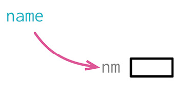

```js
let a = height * width;
```

```js
let area = height * width;
```

### 动机

好的命名是整洁编程的核心。变量可以很好地解释一段程序在干什么——如果变量名起得好的话。但我经常会把名字起错——有时是因为想得不够仔细，有时是因为我对问题的理解加深了，还有时是因为程序的用途随着用户的需求改变了。

使用范围越广，名字的好坏就越重要。只在一行的 lambda 表达式中使用的变量，跟踪起来很容易——像这样的变量，我经常只用一个字母命名，因为变量的用途在这个上下文中很清晰。同理，短函数的参数名也常常很简单。不过在 JavaScript 这样的动态类型语言中，我喜欢把类型信息也放进名字里（于是变量名可能叫 aCustomer）。

对于作用域超出一次函数调用的字段，则需要更用心命名。这是我最花心思的地方。

### 机制

- 如果变量被广泛使用，考虑运用[[../第 6 章 第一组重构/6.6 Encapsulate Variable|封装变量]]（132）将其封装起来。
- 找出所有使用该变量的代码，逐一修改。

> [!tip]
> 如果在另一个代码库中使用了该变量，这就是一个“已发布变量”（published variable），此时不能进行这个重构。

如果变量值从不修改，可以将其复制到一个新名字之下，然后逐一修改使用代码，每次修改后执行测试。

- 测试。

### 范例

如果要改名的变量只作用于一个函数（临时变量或者参数），对其改名是最简单的。这种情况太简单，根本不需要范例：找到变量的所有引用，修改过来就行。完成修改之后，我会执行测试，确保没有破坏什么东西。

如果变量的作用域不止于单个函数，问题就会出现。代码库的各处可能有很多地方使用它：

```js
let tpHd = "untitled";
```

有些地方是在读取变量值：

```js
result += `<h1>${tpHd}</h1>`;
```

另一些地方则更新它的值：

```js
tpHd = obj["articleTitle"];
```

对于这种情况，我通常的反应是运用[[../第 6 章 第一组重构/6.6 Encapsulate Variable|封装变量]]（132）：

```js
result += `<h1>${title()}</h1>`;

setTitle(obj["articleTitle"]);

function title() {
  return tpHd;
}
function setTitle(arg) {
  tpHd = arg;
}
```

现在就可以给变量改名：

```js
let _title = "untitled";

function title() {
  return _title;
}
function setTitle(arg) {
  _title = arg;
}
```

我可以继续重构下去，将包装函数内联回去，这样所有的调用者就变回直接使用变量的状态。不过我很少这样做。如果这个变量被广泛使用，以至于我感到需要先做封装才敢改名，那就有必要保持这个状态，将变量封装在函数后面。

> [!tip]
> 如果我确实想内联，在重构过程中，我就会将取值函数命名为 getTitle，并且其中的变量名也不会以下划线开头。

### 给常量改名

如果我想改名的是一个常量（或者在客户端看来就像是常量的元素），我可以复制这个常量，这样既不需要封装，又可以逐步完成改名。假如原来的变量声明是这样：

```js
const cpyNm = "Acme Gooseberries";
```

改名的第一步是复制这个常量：

```js
const companyName = "Acme Gooseberries";
const cpyNm = companyName;
```

有了这个副本，我就可以逐一修改引用旧常量的代码，使其引用新的常量。全部修改完成后，我会删掉旧的常量。我喜欢先声明新的常量名，然后把新常量复制给旧的名字。这样最后删除旧名字时会稍微容易一点，如果测试失败，再把旧常量放回来也稍微容易一点。

这个做法不仅适用于常量，也同样适用于客户端只能读取的变量（例如 JavaScript 模块中导出的变量）。