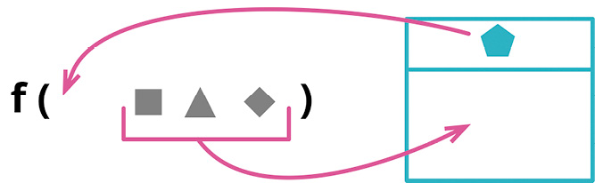

```js
function amountInvoiced(startDate, endDate) {...}
function amountReceived(startDate, endDate) {...}
function amountOverdue(startDate, endDate) {...}
```

```js
function amountInvoiced(aDateRange) {...}
function amountReceived(aDateRange) {...}
function amountOverdue(aDateRange) {...}
```

### 动机

我常会看见，一组数据项总是结伴同行，出没于一个又一个函数。这样一组数据就是所谓的数据泥团，我喜欢代之以一个数据结构。

将数据组织成结构是一件有价值的事，因为这让数据项之间的关系变得明晰。使用新的数据结构，参数的参数列表也能缩短。并且经过重构之后，所有使用该数据结构的函数都会通过同样的名字来访问其中的元素，从而提升代码的一致性。

但这项重构真正的意义在于，它会催生代码中更深层次的改变。一旦识别出新的数据结构，我就可以重组程序的行为来使用这些结构。我会创建出函数来捕捉围绕这些数据的共用行为——可能只是一组共用的函数，也可能用一个类把数据结构与使用数据的函数组合起来。这个过程会改变代码的概念图景，将这些数据结构提升为新的抽象概念，可以帮助我更好地理解问题域。果真如此，这个重构过程会产生惊人强大的效用——但如果不用引入参数对象开启这个过程，后面的一切都不会发生。

### 做法

- 如果暂时还没有一个合适的数据结构，就创建一个。

::: tip
我倾向于使用类，因为稍后把行为放进来会比较容易。我通常会尽量确保这些新建的数据结构是值对象[mf-vo]。
:::

- 测试。
- 使用[[../第 6 章 第一组重构/6.5 Change Function Declaration|改变函数声明]]（124）给原来的函数新增一个参数，类型是新建的数据结构。
- 测试。
- 调整所有调用者，传入新数据结构的适当实例。每修改一处，执行测试。
- 用新数据结构中的每项元素，逐一取代参数列表中与之对应的参数项，然后删除原来的参数。测试。

### 范例

下面要展示的代码会查看一组温度读数（reading），检查是否有任何一条读数超出了指定的运作温度范围（range）。温度读数的数据如下：

```js
const station = {
  name: "ZB1",
  readings: [
    { temp: 47, time: "2016-11-10 09:10" },
    { temp: 53, time: "2016-11-10 09:20" },
    { temp: 58, time: "2016-11-10 09:30" },
    { temp: 53, time: "2016-11-10 09:40" },
    { temp: 51, time: "2016-11-10 09:50" },
  ],
};
```

下面的函数负责找到超出指定范围的温度读数：

```js
function readingsOutsideRange(station, min, max) {
 return station.readings
  .filter(r =&gt; r.temp &lt; min || r.temp &gt; max);
}
```

调用该函数的代码可能是下面这样的。

调用方

```js
alerts = readingsOutsideRange(
  station,
  operatingPlan.temperatureFloor,
  operatingPlan.temperatureCeiling
);
```

请注意，这里的调用代码从另一个对象中抽出两项数据，转手又把这一对数据传递给 readingsOutsideRange。代表“运作计划”的 operatingPlan 对象用了另外的名字来表示温度范围的下限和上限，与 readingsOutsideRange 中所用的名字不同。像这样用两项各不相干的数据来表示一个范围的情况并不少见，最好是将其组合成一个对象。我会首先为要组合的数据声明一个类：

```js
class NumberRange {
  constructor(min, max) {
    this._data = { min: min, max: max };
  }
  get min() {
    return this._data.min;
  }
  get max() {
    return this._data.max;
  }
}
```

我声明了一个类，而不是基本的 JavaScript 对象，因为这个重构通常只是一系列重构的起点，随后我会把行为搬移到新建的对象中。既然类更适合承载数据与行为的组合，我就直接从声明一个类开始。同时，在这个新类中，我不会提供任何更新数据的函数，因为我有可能将其处理成值对象（Value Object）[mf-vo]。在使用这个重构手法时，大多数情况下我都会创建值对象。

然后我会运用[[../第 6 章 第一组重构/6.5 Change Function Declaration|改变函数声明]]（124），把新的对象作为参数传给 readingsOutsideRange。

```js
function readingsOutsideRange(station, min, max, range) {
 return station.readings
  .filter(r =&gt; r.temp &lt; min || r.temp &gt; max);
}
```

在 JavaScript 中，此时我不需要修改调用方代码，但在其他语言中，我必须在调用处为新参数传入 null 值，就像下面这样。

调用方

```js
alerts = readingsOutsideRange(
  station,
  operatingPlan.temperatureFloor,
  operatingPlan.temperatureCeiling,
  null
);
```

到目前为止，我还没有修改任何行为，所以测试应该仍然能通过。随后，我会挨个找到函数的调用处，传入合适的温度范围。

调用方

```js
const range = new NumberRange(
  operatingPlan.temperatureFloor,
  operatingPlan.temperatureCeiling
);
alerts = readingsOutsideRange(
  station,
  operatingPlan.temperatureFloor,
  operatingPlan.temperatureCeiling,
  range
);
```

此时我还是没有修改任何行为，因为新添的参数没有被使用。所有测试应该仍然能通过。

现在我可以开始修改使用参数的代码了。先从“最大值”开始：

```js
function readingsOutsideRange(station, min, max, range) {
 return station.readings
  .filter(r =&gt; r.temp &lt; min || r.temp &gt; range.max);
}
```

调用方

```js
const range = new NumberRange(
  operatingPlan.temperatureFloor,
  operatingPlan.temperatureCeiling
);
alerts = readingsOutsideRange(
  station,
  operatingPlan.temperatureFloor,
  operatingPlan.temperatureCeiling,
  range
);
```

此时要执行测试。如果测试通过，我再接着处理另一个参数。

```js
function readingsOutsideRange(station, min, range) {
 return station.readings
  .filter(r =&gt; r.temp &lt; range.min || r.temp &gt; range.max);
}
```

调用方

```js
const range = new NumberRange(
  operatingPlan.temperatureFloor,
  operatingPlan.temperatureCeiling
);
alerts = readingsOutsideRange(station, operatingPlan.temperatureFloor, range);
```

这项重构手法到这儿就完成了。不过，将一堆参数替换成一个真正的对象，这只是长征第一步。创建一个类是为了把行为搬移进去。在这里，我可以给“范围”类添加一个函数，用于测试一个值是否落在范围之内。

```js
function readingsOutsideRange(station, range) {
 return station.readings
  .f ilter(r =&gt; !range.contains(r.temp));
}
```

#### class NumberRange...

```js
  contains(arg) {return (arg &gt;= this.min &amp;&amp; arg &lt;= this.max);}
```

这样我就迈出了第一步，开始逐渐打造一个真正有用的“范围”[mf-range]类。一旦识别出“范围”这个概念，那么每当我在代码中发现“最大/最小值”这样一对数字时，我就会考虑是否可以将其改为使用“范围”类。（例如，我马上就会考虑把“运作计划”类中的 temperatureFloor 和 temperatureCeiling 替换为 temperatureRange。）在观察这些成对出现的数字如何被使用时，我会发现一些有用的行为，并将其搬移到“范围”类中，简化其使用方法。比如，我可能会先给这个类加上“基于数值判断相等性”的函数，使其成为一个真正的值对象。