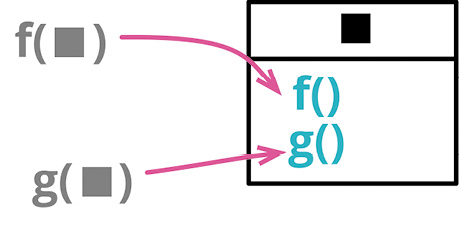

```js
function base(aReading) {...}
function taxableCharge(aReading) {...}
function calculateBaseCharge(aReading) {...}
```

```js
class Reading {
  base() {...}
  taxableCharge() {...}
  calculateBaseCharge() {...}
}
```

### 动机

类，在大多数现代编程语言中都是基本的构造。它们把数据与函数捆绑到同一个环境中，将一部分数据与函数暴露给其他程序元素以便协作。它们是面向对象语言的首要构造，在其他程序设计方法中也同样有用。

如果发现一组函数形影不离地操作同一块数据（通常是将这块数据作为参数传递给函数），我就认为，是时候组建一个类了。类能明确地给这些函数提供一个共用的环境，在对象内部调用这些函数可以少传许多参数，从而简化函数调用，并且这样一个对象也可以更方便地传递给系统的其他部分。

除了可以把已有的函数组织起来，这个重构还给我们一个机会，去发现其他的计算逻辑，将它们也重构到新的类当中。

将函数组织到一起的另一种方式是[[6.10 Combine Functions into Transform|函数组合成变换]]（149）。具体使用哪个重构手法，要看程序整体的上下文。使用类有一大好处：客户端可以修改对象的核心数据，通过计算得出的派生数据则会自动与核心数据保持一致。

类似这样的一组函数不仅可以组合成一个类，而且可以组合成一个嵌套函数。通常我更倾向于类而非嵌套函数，因为后者测试起来会比较困难。如果我想对外暴露多个函数，也必须采用类的形式。

在有些编程语言中，类不是一等公民，而函数则是。面对这样的语言，可以用“函数作为对象”（Function As Object）[mf-fao]的形式来实现这个重构手法。

### 做法

- 运用[[../第 7 章 封装/7.1 Encapsulate Record|封装记录]]（162）对多个函数共用的数据记录加以封装。

::: tip
如果多个函数共用的数据还未组织成记录结构，则先运用[[../第 6 章 第一组重构/6.8 Introduce Parameter Object|引入参数对象]]（140）将其组织成记录。
:::

- 对于使用该记录结构的每个函数，运用[[../第 8 章 搬移特性/8.1 Move Function|搬移函数]]（198）将其移入新类。

::: tip
如果函数调用时传入的参数已经是新类的成员，则从参数列表中去除之。
:::

- 用以处理该数据记录的逻辑可以用[[6.1 Extract Function|提炼函数]]（106）提炼出来，并移入新类。

### 范例

我在英格兰长大，那是一个热爱喝茶的国度。（个人而言，我不喜欢在英格兰喝到的大部分茶，对中国茶和日本茶倒是情有独钟。）所以，我虚构了一种用于向老百姓供给茶水的公共设施。每个月会有软件读取茶水计量器的数据，得到类似这样的读数（reading）：

```js
reading = { customer: "ivan", quantity: 10, month: 5, year: 2017 };
```

浏览处理这些数据记录的代码，我发现有很多地方在做着相似的计算，于是我找到了一处计算“基础费用”（base charge）的逻辑。

#### 客户端 1...

```js
const aReading = acquireReading();
const baseCharge = baseRate(aReading.month, aReading.year) * aReading.quantity;
```

在英格兰，一切生活必需品都得交税，茶自然也不例外。不过，按照规定，只要不超出某个必要用量，就不用交税。

#### 客户端 2...

```js
const aReading = acquireReading();
const base = baseRate(aReading.month, aReading.year) * aReading.quantity;
const taxableCharge = Math.max(0, base - taxThreshold(aReading.year));
```

我相信你也发现了：计算基础费用的公式被重复了两遍。如果你跟我有一样的习惯，现在大概已经在着手[[6.1 Extract Function|提炼函数]]（106）了。有趣的是，好像别人已经动过这个脑筋了。

#### 客户端 3...

```js
const aReading = acquireReading();
const basicChargeAmount = calculateBaseCharge(aReading);

function calculateBaseCharge(aReading) {
  return baseRate(aReading.month, aReading.year) * aReading.quantity;
}
```

看到这里，我有一种自然的冲动，想把前面两处客户端代码都改为使用这个函数。但这样一个顶层函数的问题在于，它通常位于一个文件中，读者不一定能想到来这里寻找它。我更愿意对代码多做些修改，让该函数与其处理的数据在空间上有更紧密的联系。为此目的，不妨把数据本身变成一个类。

我可以运用[[../第 7 章 封装/7.1 Encapsulate Record|封装记录]]（162）将记录变成类。

```js
class Reading {
  constructor(data) {
    this._customer = data.customer;
    this._quantity = data.quantity;
    this._month = data.month;
    this._year = data.year;
  }
  get customer() {
    return this._customer;
  }
  get quantity() {
    return this._quantity;
  }
  get month() {
    return this._month;
  }
  get year() {
    return this._year;
  }
}
```

首先，我想把手上已有的函数 calculateBaseCharge 搬到新建的 Reading 类中。一得到原始的读数数据，我就用 Reading 类将它包装起来，然后就可以在函数中使用 Reading 类了。

#### 客户端 3...

```js
const rawReading = acquireReading();
const aReading = new Reading(rawReading);
const basicChargeAmount = calculateBaseCharge(aReading);
```

然后我用[[../第 8 章 搬移特性/8.1 Move Function|搬移函数]]（198）把 calculateBaseCharge 搬到新类中。

#### class Reading...

```js
  get calculateBaseCharge() {
  return baseRate(this.month, this.year) * this.quantity;
}
```

#### 客户端 3...

```js
const rawReading = acquireReading();
const aReading = new Reading(rawReading);
const basicChargeAmount = aReading.calculateBaseCharge;
```

搬移的同时，我会顺便运用函数改名（124），按照我喜欢的风格对这个函数改名。

```js
  get baseCharge() {
  return baseRate(this.month, this.year) * this.quantity;
}
```

#### 客户端 3...

```js
const rawReading = acquireReading();
const aReading = new Reading(rawReading);
const basicChargeAmount = aReading.baseCharge;
```

用这个名字，Reading 类的客户端将不知道 baseCharge 究竟是一个字段还是推演计算出的值。这是好事，它符合“统一访问原则”（Uniform Access Principle）[mf-ua]。

现在我可以修改客户端 1 的代码，令其调用新的方法，不要重复计算基础费用。

#### 客户端 1...

```js
const rawReading = acquireReading();
const aReading = new Reading(rawReading);
const baseCharge = aReading.baseCharge;
```

很有可能我会顺手用[[6.4 Inline Variable|内联变量]]（123）把 baseCharge 变量给去掉。不过，我们当下介绍的重构手法更关心“计算应税费用”的逻辑。同样，我先将那里的客户端代码改为使用新建的 baseCharge 属性。

#### 客户端 2...

```js
const rawReading = acquireReading();
const aReading = new Reading(rawReading);
const taxableCharge = Math.max(
  0,
  aReading.baseCharge - taxThreshold(aReading.year)
);
```

运用[[6.1 Extract Function|提炼函数]]（106）将计算应税费用（taxable charge）的逻辑提炼成函数：

```js
function taxableChargeFn(aReading) {
  return Math.max(0, aReading.baseCharge - taxThreshold(aReading.year));
}
```

#### 客户端 3...

```js
const rawReading = acquireReading();
const aReading = new Reading(rawReading);
const taxableCharge = taxableChargeFn(aReading);
```

然后我运用[[../第 8 章 搬移特性/8.1 Move Function|搬移函数]]（198）将其移入 Reading 类：

#### class Reading...

```js
get taxableCharge() {
  return Math.max(0, this.baseCharge - taxThreshold(this.year));
}
```

#### 客户端 3...

```js
const rawReading = acquireReading();
const aReading = new Reading(rawReading);
const taxableCharge = aReading.taxableCharge;
```

由于所有派生数据都是在使用时计算得出的，所以对存储下来的读数进行修改也没问题。一般而论，我更倾向于使用不可变的数据；但很多时候我们必须得使用可变数据（比如 JavaScript 整个语言生态在设计时就没有考虑数据的不可变性）。如果数据确有可能被更新，那么用类将其封装起来会很有帮助。